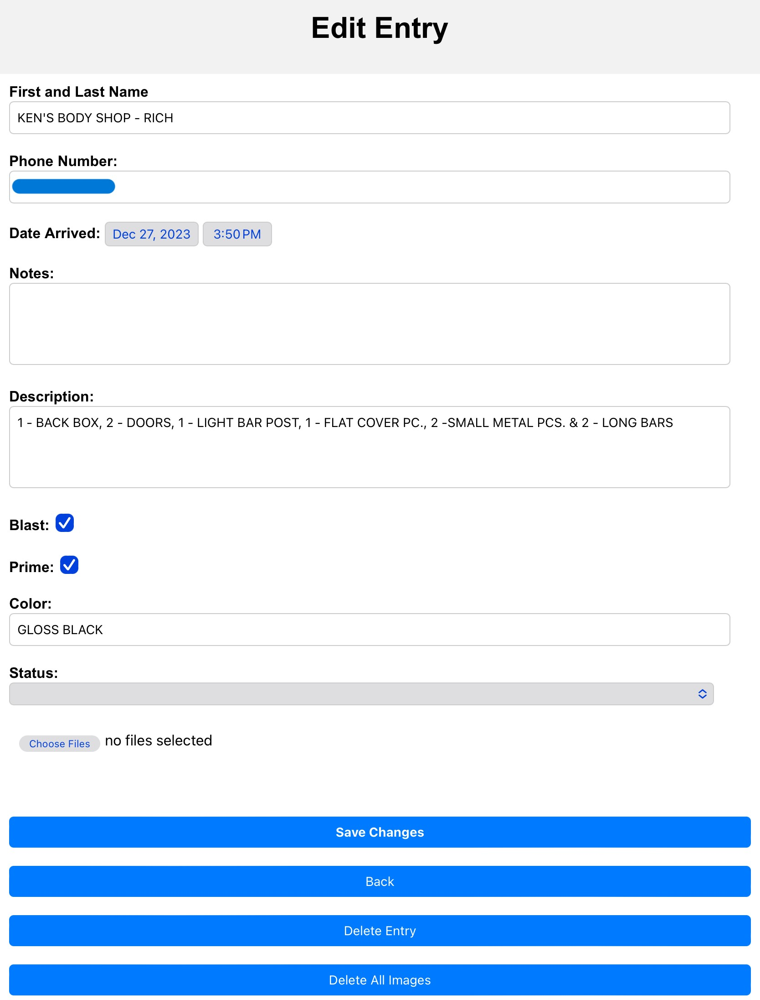

## Intro

Website created for CRM Inc. to provide part tracking. The intent is for this program to be used on both mobile and desktop applications. The part tracking improves tracability for employees and upper management.

## Usage

The login is only to those who are authorized. Once authorized, the user is able to add entries, edit entried, add photos to entries, and sort all entries provided from the database. This website works through a system of inputs from Google Forms, Google Sheets, Firebase, and others.

## Preview

The login is authentication provided by Firebase. The users are split into two types of users, employees and customers. Customers have limited access and are only able to add and view entries. Employees have full access and are allowed to add, remove, edit and view entries. 

The list screen allows for users to sort all the available entries by different entities as well as tap/click on each entry to edit them.

The add entries page allows for users to add information about customers as well as upload pictures that use firebase storage to hold images.

The edit entries page allows for users to change any data that has been added, delete pictures, and add new pictures.

